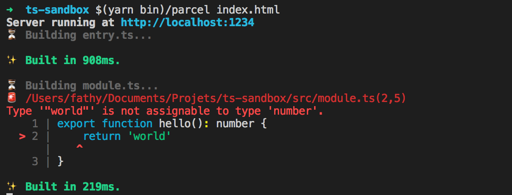

# parcel-plugin-typescript

Enhanced TypeScript integration for Parcel.

## Differences with Parcel native support

Parcel has built-in transpiling support for TypeScript OOB. This plugin provides additionnal features listed in [Features](#features).

If you only need transpiling then this plugin might not be necessary. You can see
this plugin as a Parcel version of `awesome-typescript-loader` or `ts-loader`.

This plugin is in it's early stage and may not be stable. This first stable version will be `1.0.0`.

## Features

- Transpiling: this is what you get when this plugin is not installed, straight and simple
transpilation TS -> JS
- Type checking: it checks your TypeScript code for errors in a separated process for speed
- Path mappings: it rewrites your `import` on the fly accordingly to your `paths` and `baseUrl`
compiler options
- Angular support (experimental, only enabled if Angular is installed) :
	- AOT compilation, using the official Angular compiler for smaller and faster applications.
	- Lazy Loading, the plugin automagically splits your Angular modules in multiple JavaScript files with Parcel when you use lazy routes.
	- Template parsing, your templates are processed by Parcel to find and replaces resources, even in AOT.
	- Transformations :
		- It removes all your Angular decorators in AOT mode for smaller bundles
		- It replaces the `@angular/platform-browser-dynamic` with `@angular/platform-browser` module in AOT mode, so you can keep one main file

### Coming features

- TSLint support
- User defined AST transformers

## Installation
`yarn add parcel-plugin-typescript`

or

`npm install parcel-plugin-typescript`

And that's it, z e r o configuration.
